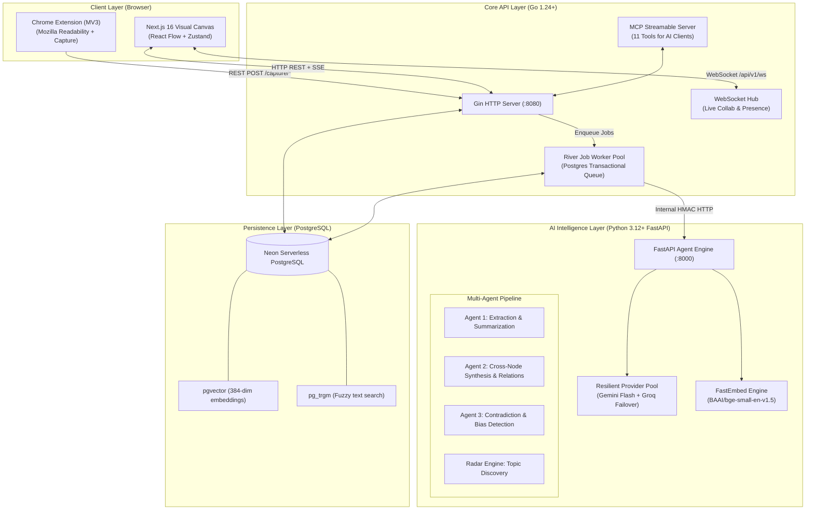
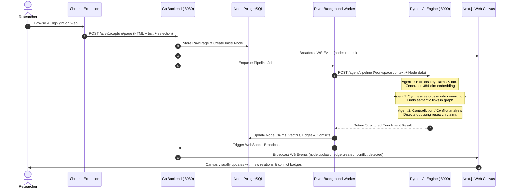

# Architecture & System Design — ResearchMap (3-Idiots)

> **Context Ledger & System Architecture**  
> Source of truth for architectural decisions, system topology, and technology choices.

---

## 1. System Topology

---

## 2. Core Architectural Decisions

### 2.1 Backend: Go (Gin) + Neon PostgreSQL + River
* **Why Go?** Ultra-low latency, concurrent goroutines for WebSocket connections, high throughput for extension capture events, and single static binary deployment.
* **Why Neon PostgreSQL with `pgvector` & `pg_trgm`?** Provides relational guarantees (ACID) for workspaces, branches, nodes, and edges, combined with native vector similarity search for node embeddings without running a separate vector database (e.g., Pinecone/Milvus/Qdrant).
* **Why River Queue instead of Redis/Celery?** River runs entirely on PostgreSQL using transactional job enqueueing (`SKIP LOCKED`). If a workspace transaction rolls back, the AI job is never scheduled. This eliminates distributed state failure modes and removes Redis as an external infrastructure dependency.

### 2.2 AI Service: Python FastAPI + Resilient Provider Pool
* **Why Python for the AI Service?** Rich ecosystem for AI evaluation, FastEmbed ONNX runtime, and rapid prompt engineering.
* **Dual Multi-Key Provider Architecture:**
  - **Gemini Pool (Primary):** Rotates across multiple Google Gemini API keys (`GEMINI_API_KEY_1..4`) with automatic failover on HTTP 429 / quota exhaustion. Handled heavy analytical tasks (Agent 1 extraction, Agent 2 relation synthesis, Agent 3 conflict detection, session report generation).
  - **Groq Pool (Fallback & Fast Tasks):** Rotates across multiple Groq keys (`GROQ_API_KEY_1..4`). Powers instant radar recommendations and acts as a hot fallback if all Gemini keys are throttled.
* **Why Local FastEmbed (`bge-small-en-v1.5`)?** Produces 384-dimensional dense vector embeddings using local ONNX runtime on CPU. Generates embeddings in sub-50ms without consuming third-party API quotas, enabling instant semantic indexing for every captured web node.

### 2.3 Frontend: Next.js 16 + React Flow + Zustand
* **Visual Graph Canvas:** Custom nodes and edges rendered with React Flow, supporting multi-level clustering, parent-child topic hierarchy, and smooth zoom/pan navigation.
* **Dual-Mode Transport (`NEXT_PUBLIC_API_MODE`):**
  - `http`: Full production mode proxying to the Go backend with secure `httpOnly` JWT cookies.
  - `mock`: Self-contained in-browser localStorage mock backend for offline demonstrations and instantaneous frontend testing.
* **State Management:** Zustand stores segmented by domain (`auth`, `graph`, `session`, `extension`, `ui`), paired with TanStack Query for optimistic mutations and automatic cache invalidation.

### 2.4 Model Context Protocol (MCP) Server
* **Streamable HTTP Endpoint (`/api/v1/mcp`):** Native integration allowing AI desktop clients (Claude Desktop, Cursor, OpenCodeInterpreter) to read workspaces, query nodes, create research notes, and inspect detected conflicts through 11 standardized tools.
* **Provenance Tracking (`created_by_mcp_client`):** Schema migration `00003_mcp_provenance.sql` attributes every node/edge created by an external AI assistant.

---

## 3. Data Flow & Multi-Agent Pipeline

---

## 4. Persistent Engineering Principles

1. **Zero Silent Deletions:** Always preserve business logic, migrations, and comments. Refactors must explicitly justify removals.
2. **Resilience by Design:** Multi-provider fallback ensures the platform continues operating even under severe external API rate-limiting.
3. **Transactional Integrity:** Jobs, events, and graph mutations follow PostgreSQL transactional semantics.
