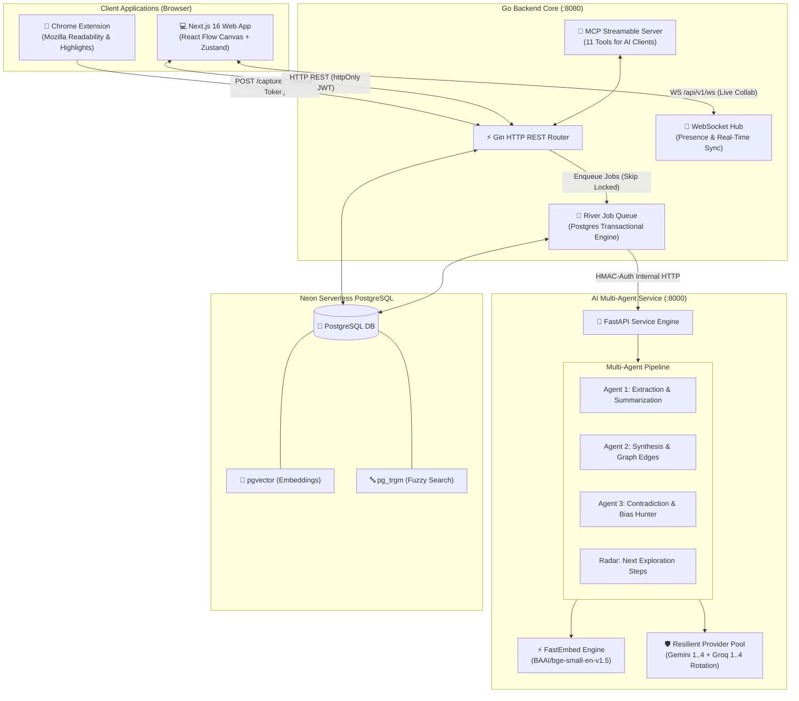
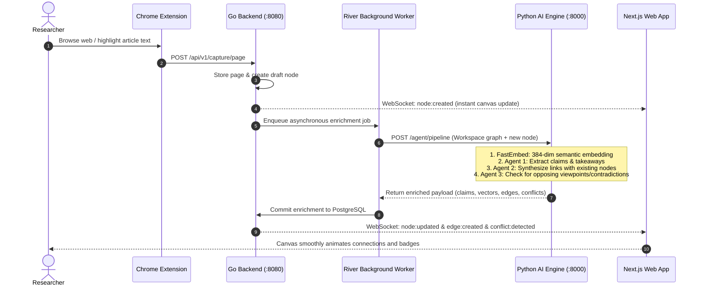

# 🧠 ResearchMap (3-Idiots)

> **Autonomous AI Knowledge Mapping, Web Research Capture & Multi-Agent Synthesis Engine**  
> Transform passive web browsing into an interactive, structured, self-organizing research graph with real-time contradiction detection and Model Context Protocol (MCP) support.

[](https://golang.org)
[](https://python.org)
[](https://nextjs.org)
[](https://neon.tech)
[](https://modelcontextprotocol.io)

---

## 🌟 Overview & Key Features

ResearchMap automates knowledge discovery and curation. While you research the web, our Chrome Extension captures content and browsing pathways. A resilient multi-agent intelligence pipeline automatically extracts factual claims, links concepts across sources, uncovers contradictions, and maps your findings into a dynamic React Flow knowledge canvas.

* **🧩 Autonomous 3-Stage Multi-Agent Pipeline:**
  * **Agent 1 (Extraction & Summarization):** Isolates core theses, takeaways, key claims, and generates 384-dimensional dense semantic embeddings using FastEmbed (`bge-small-en-v1.5`).
  * **Agent 2 (Synthesis & Relationship Mapping):** Discovers latent semantic connections between independently captured pages, establishing directed graph edges with reasoning.
  * **Agent 3 (Contradiction & Bias Detection):** Scans the research graph for conflicting evidence or differing methodologies, flagging disputes directly on the visual graph.
  * **Radar Engine:** Generates proactive research questions and recommends undiscovered topics to explore next.
* **🛡️ Resilient Dual-Provider LLM Fallback Pool:**
  * **Google Gemini Pool:** Primary engine for complex reasoning (Agent 1, Agent 2, Conflicts, Reports). Multi-key rotation (`GEMINI_API_KEY_1..4`) eliminates rate-limit interruptions.
  * **Groq Pool:** High-speed engine for radar recommendations and automatic failover if Gemini keys are throttled.
* **⚡ Real-Time Collaborative Canvas:**
  * Interactive infinite canvas built on Next.js 16, React Flow, and Zustand.
  * Live multi-user presence, optimistic UI mutations, and bi-directional WebSocket event synchronization.
* **🌐 Chrome Web Extension (Manifest V3):**
  * One-click and automatic background page capture powered by Mozilla Readability.
  * Real-time highlight extraction, reading time tracking, and tab session correlation.
* **🔌 Native Model Context Protocol (MCP) Server:**
  * Built-in Streamable HTTP MCP server on `/api/v1/mcp` with 11 specialized tools.
  * Seamlessly connect AI assistants (Claude Desktop, Cursor) to interact with and query your research maps.

---

## 🏗️ System Architecture



---

## 🔄 Autonomous Multi-Agent Pipeline Workflow



---

## ⚙️ Environment Configuration

The repository includes a top-level [`.env.example`](file:///.env.example) and individual service example files:
- [Backend: `backend/.env.example`](file:///backend/.env.example)
- [AI Agent: `agent/.env.example`](file:///agent/.env.example)
- [Frontend: `frontend/.env.example`](file:///frontend/.env.example)

### 1. Backend (`backend/.env`)
Copy `backend/.env.example` to `backend/.env`:
```bash
cp backend/.env.example backend/.env
```
Key variables:
| Variable | Description | Default |
|---|---|---|
| `API_ADDR` | Listening port for the Go server | `:8080` |
| `DATABASE_URL` | Neon PostgreSQL direct connection string with `sslmode=require` | *Required* |
| `WEB_ORIGINS` | Allowed CORS origins for cookies and WebSocket | `http://localhost:3000` |
| `JWT_SECRET` | Secret key for signing session cookies (min 32 chars) | *Generate via `openssl rand -hex 32`* |
| `AGENT_URL` | Base URL of the internal Python AI service | `http://127.0.0.1:8000` |
| `AGENT_INTERNAL_KEY` | Shared pre-shared key matching `agent/.env` | *Secret min 16 chars* |

### 2. AI Service (`agent/.env`)
Copy `agent/.env.example` to `agent/.env`:
```bash
cp agent/.env.example agent/.env
```
Key variables:
| Variable | Description |
|---|---|
| `AGENT_INTERNAL_KEY` | Must match `AGENT_INTERNAL_KEY` in `backend/.env` |
| `GEMINI_API_KEY_1..4` | Pool of Google Gemini API keys (rotated automatically on 429) |
| `GROQ_API_KEY_1..4` | Pool of Groq API keys (rotated automatically for radar & fallback) |
| `EMBEDDING_MODEL` | FastEmbed local ONNX model (`BAAI/bge-small-en-v1.5`) |

### 3. Frontend (`frontend/.env.local`)
Copy `frontend/.env.example` to `frontend/.env.local`:
```bash
cp frontend/.env.example frontend/.env.local
```
Key variables:
| Variable | Description | Default |
|---|---|---|
| `NEXT_PUBLIC_API_MODE` | API mode: `http` (live Go backend) or `mock` (in-browser demo) | `http` |
| `API_PROXY_TARGET` | Target for Next.js internal proxy (preserves cookies) | `http://localhost:8080` |
| `NEXT_PUBLIC_WS_URL` | WebSocket endpoint for real-time collaboration | `ws://localhost:8080/api/v1/ws` |
| `NEXT_PUBLIC_EXTENSION_ID` | Extension ID for native Chrome messaging bridge | `bfphemfnigknpgmhiaknanilpjiifjlp` |

---

## 🚀 Quickstart & Running Locally

### Prerequisites
* **Go 1.24+**
* **Python 3.12+** with [`uv`](https://docs.astral.sh/uv/) installed
* **Node.js 20+** and `npm`
* **Google Chrome** (for testing the extension)
* **PostgreSQL with pgvector** (e.g. free tier on [Neon](https://neon.tech))

---

### Step 1: Run the AI Agent Service (Python)
```bash
cd agent
# Install dependencies into virtual environment
uv sync
# Run FastAPI server on port 8000
uv run uvicorn app.main:app --port 8000 --reload
```
Health check: Visit `http://127.0.0.1:8000/healthz`

---

### Step 2: Run the Backend Service (Go)
```bash
cd backend
# Run database migrations and start server on port 8080
go run ./cmd/server
```
Health checks:
- Liveness: `http://localhost:8080/healthz`
- Database readiness: `http://localhost:8080/readyz`

---

### Step 3: Run the Web Application (Next.js)
```bash
cd frontend
# Install npm dependencies
npm install
# Start development server on port 3000
npm run dev
```
Open `http://localhost:3000` in your browser. Register an account or log in.

---

### Step 4: Install the Chrome Web Extension
1. Open Google Chrome and navigate to `chrome://extensions/`.
2. Toggle on **Developer mode** in the top-right corner.
3. Click **Load unpacked** and select the [`extension/`](file:///extension) directory in this repo.
4. Pin the **ResearchMap** icon to your browser toolbar.
5. In the web application settings, generate an **Extension Token** and paste it into the extension popup.

---

## 🔌 Model Context Protocol (MCP) Integration

ResearchMap features a native Model Context Protocol (MCP) server over Streamable HTTP at `http://localhost:8080/api/v1/mcp`.

### Connecting Claude Desktop
Add this to your Claude Desktop configuration (`claude_desktop_config.json`):

```json
{
  "mcpServers": {
    "researchmap": {
      "command": "npx",
      "args": [
        "-y",
        "@modelcontextprotocol/server-sse",
        "http://localhost:8080/api/v1/mcp"
      ]
    }
  }
}
```

### Available MCP Tools (11 Tools)
| Tool Name | Description |
|---|---|
| `list_workspaces` | Lists all research workspaces accessible by the user |
| `get_workspace_graph` | Returns nodes, edges, topics, and visual layout of a workspace |
| `search_nodes` | Performs vector semantic search and text matching across research nodes |
| `get_node_details` | Retrieves full article text, takeaways, claims, and annotations |
| `create_research_note` | Creates a new research node with automated AI provenance tracking |
| `connect_nodes` | Creates a directed semantic relationship edge between two nodes |
| `list_conflicts` | Lists detected contradictory claims and opposing research evidence |
| `resolve_conflict` | Updates the resolution status or methodology note of a conflict |
| `get_radar_recommendations`| Fetches AI radar exploration ideas and suggested next research queries |
| `export_workspace` | Exports the research workspace to Markdown, JSON, or BibTeX citations |
| `summarize_session` | Generates a comprehensive research progress report with citations |

---

## 🧪 Testing & Quality Assurance

Run the test suite across all services:

```bash
# 1. Backend Go Tests
cd backend
go test ./...

# 2. Python AI Agent Tests (15 unit & integration tests)
cd ../agent
uv run pytest

# 3. Frontend TypeScript Typecheck
cd ../frontend
npx tsc --noEmit
```

---

## 📁 Repository Structure

```
3-idiots/
├── .env.example             # Master reference for all environment variables
├── ARCHITECTURE.md          # Architectural context ledger and design decisions
├── IMPLEMENTATION_STATUS.md # Granular phase-by-phase implementation ledger
├── README.md                # Project documentation & quickstart guide
│
├── backend/                 # Go 1.24+ Backend Service
│   ├── cmd/server/          # Main HTTP / WS / MCP entrypoint
│   ├── internal/app/        # Handlers: auth, capture, nodes, edges, mcp, ws, pipeline
│   ├── internal/config/     # Environment variable loader
│   ├── internal/db/         # Migrations (pgvector, schema, mcp provenance)
│   └── internal/httpx/      # HTTP middleware, CORS, security, JWT cookies
│
├── agent/                   # Python 3.12+ AI Intelligence Service
│   ├── app/main.py          # FastAPI application & pipeline orchestration
│   ├── app/providers.py     # Gemini & Groq multi-key resilient pool
│   └── tests/               # Pytest suite for agents and provider failover
│
├── frontend/                # Next.js 16 Web Application
│   ├── app/                 # App Router (login, register, workspace, radar, journey)
│   ├── features/canvas/     # React Flow knowledge graph visualization
│   ├── features/panels/     # Node details, conflicts, radar, sidebars
│   ├── lib/api/             # Typed API clients for all backend endpoints
│   ├── lib/ws/              # WebSocket client abstraction with reconnection
│   ├── mock/                # In-browser mock backend for standalone demo mode
│   └── stores/              # Zustand domain stores (graph, session, auth)
│
├── extension/               # Chrome Web Extension (Manifest V3)
│   ├── background.js        # Background service worker with tab & capture tracking
│   ├── popup.html / .js     # Extension popup UI with active session toggle
│   └── vendor/              # Mozilla Readability library for DOM extraction
│
└── scripts/                 # Utility & automated validation scripts
    └── mcp_e2e.py           # End-to-end automated testing script for MCP server
```

---

## 📜 License

MIT License. Designed and engineered for hackathons, researchers, and AI developers.
